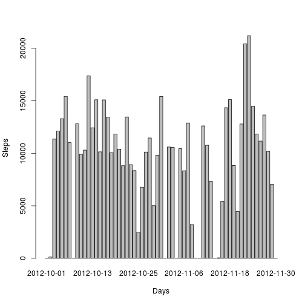

Assignment 1
========================================================
## Reading the data file

```r
 dataFile <- read.csv('activity.csv')
```
## Daily steps taken
### Histogram of the total number of steps taken each day

```r
dailySteps <- aggregate(dataFile$steps,list(dataFile$date),sum,na.rm=TRUE)

barplot(dailySteps$x, names.arg=as.Date(dailySteps$Group.1), ylab="Steps", xlab="Days")
```

 
### Daily mean steps

```r
dailyMeanSteps <- aggregate(dataFile$steps,list(dataFile$date),mean,na.rm=TRUE)
colnames(dailyMeanSteps) <- c('date','steps')
dailyMeanSteps <- replace(dailyMeanSteps,is.na(dailyMeanSteps),0)
dailyMeanSteps
```

```
##          date      steps
## 1  2012-10-01  0.0000000
## 2  2012-10-02  0.4375000
## 3  2012-10-03 39.4166667
## 4  2012-10-04 42.0694444
## 5  2012-10-05 46.1597222
## 6  2012-10-06 53.5416667
## 7  2012-10-07 38.2465278
## 8  2012-10-08  0.0000000
## 9  2012-10-09 44.4826389
## 10 2012-10-10 34.3750000
## 11 2012-10-11 35.7777778
## 12 2012-10-12 60.3541667
## 13 2012-10-13 43.1458333
## 14 2012-10-14 52.4236111
## 15 2012-10-15 35.2048611
## 16 2012-10-16 52.3750000
## 17 2012-10-17 46.7083333
## 18 2012-10-18 34.9166667
## 19 2012-10-19 41.0729167
## 20 2012-10-20 36.0937500
## 21 2012-10-21 30.6284722
## 22 2012-10-22 46.7361111
## 23 2012-10-23 30.9652778
## 24 2012-10-24 29.0104167
## 25 2012-10-25  8.6527778
## 26 2012-10-26 23.5347222
## 27 2012-10-27 35.1354167
## 28 2012-10-28 39.7847222
## 29 2012-10-29 17.4236111
## 30 2012-10-30 34.0937500
## 31 2012-10-31 53.5208333
## 32 2012-11-01  0.0000000
## 33 2012-11-02 36.8055556
## 34 2012-11-03 36.7048611
## 35 2012-11-04  0.0000000
## 36 2012-11-05 36.2465278
## 37 2012-11-06 28.9375000
## 38 2012-11-07 44.7326389
## 39 2012-11-08 11.1770833
## 40 2012-11-09  0.0000000
## 41 2012-11-10  0.0000000
## 42 2012-11-11 43.7777778
## 43 2012-11-12 37.3784722
## 44 2012-11-13 25.4722222
## 45 2012-11-14  0.0000000
## 46 2012-11-15  0.1423611
## 47 2012-11-16 18.8923611
## 48 2012-11-17 49.7881944
## 49 2012-11-18 52.4652778
## 50 2012-11-19 30.6979167
## 51 2012-11-20 15.5277778
## 52 2012-11-21 44.3993056
## 53 2012-11-22 70.9270833
## 54 2012-11-23 73.5902778
## 55 2012-11-24 50.2708333
## 56 2012-11-25 41.0902778
## 57 2012-11-26 38.7569444
## 58 2012-11-27 47.3819444
## 59 2012-11-28 35.3576389
## 60 2012-11-29 24.4687500
## 61 2012-11-30  0.0000000
```

### Daily median steps


```r
medianFrame <- data.frame(date = character(0),median_steps=numeric(0))
aaa <- numeric()
dateVector <- as.vector(dataFile$date)
stepsVector <- as.vector(dataFile$steps)

for(i in seq_along(dateVector)){    
    if(i==length(dateVector) || dateVector[i] != dateVector[i+1]){        
        medianFrame <- rbind(medianFrame, data.frame(date = dateVector[i],median_steps = median(aaa)))
        aaa = numeric()
    }  
    else if(!is.na(stepsVector[i])){
            aaa <- c(aaa,stepsVector[i])           
    }
}
medianFrame
```

```
##          date median_steps
## 1  2012-10-01           NA
## 2  2012-10-02            0
## 3  2012-10-03            0
## 4  2012-10-04            0
## 5  2012-10-05            0
## 6  2012-10-06            0
## 7  2012-10-07            0
## 8  2012-10-08           NA
## 9  2012-10-09            0
## 10 2012-10-10            0
## 11 2012-10-11            0
## 12 2012-10-12            0
## 13 2012-10-13            0
## 14 2012-10-14            0
## 15 2012-10-15            0
## 16 2012-10-16            0
## 17 2012-10-17            0
## 18 2012-10-18            0
## 19 2012-10-19            0
## 20 2012-10-20            0
## 21 2012-10-21            0
## 22 2012-10-22            0
## 23 2012-10-23            0
## 24 2012-10-24            0
## 25 2012-10-25            0
## 26 2012-10-26            0
## 27 2012-10-27            0
## 28 2012-10-28            0
## 29 2012-10-29            0
## 30 2012-10-30            0
## 31 2012-10-31            0
## 32 2012-11-01           NA
## 33 2012-11-02            0
## 34 2012-11-03            0
## 35 2012-11-04           NA
## 36 2012-11-05            0
## 37 2012-11-06            0
## 38 2012-11-07            0
## 39 2012-11-08            0
## 40 2012-11-09           NA
## 41 2012-11-10           NA
## 42 2012-11-11            0
## 43 2012-11-12            0
## 44 2012-11-13            0
## 45 2012-11-14           NA
## 46 2012-11-15            0
## 47 2012-11-16            0
## 48 2012-11-17            0
## 49 2012-11-18            0
## 50 2012-11-19            0
## 51 2012-11-20            0
## 52 2012-11-21            0
## 53 2012-11-22            0
## 54 2012-11-23            0
## 55 2012-11-24            0
## 56 2012-11-25            0
## 57 2012-11-26            0
## 58 2012-11-27            0
## 59 2012-11-28            0
## 60 2012-11-29            0
## 61 2012-11-30           NA
```

### Average steps per interval

```r
intervalAvgSum <- 0
intervalVector <- as.vector(dataFile$interval)
avgDataFrame <- data.frame(interval=numeric(0),avg_steps=numeric(0))
intervalAvg <- 0
intervalMaxAvg <- -1
maxAvgInterval <- 1
for(i in seq_along(stepsVector)){
         if(is.na(stepsVector[i])){
              intervalAvgSum <- intervalAvgSum+0
        }else{
              intervalAvgSum <- intervalAvgSum+stepsVector[i]
          }
       intervalAvg <-intervalAvgSum/i  
       avgDataFrame <- rbind(avgDataFrame, data.frame(interval=intervalVector[i],avg_steps=intervalAvg))     
       
       if(intervalAvg > intervalMaxAvg){
          intervalMaxAvg <- intervalAvg
          maxAvgInterval <- intervalVector[i]
       }
}
plot(avgDataFrame$interval,avgDataFrame$avg_steps,type="l")
```

 
### The interval containing the maximum steps on average is 915 with value equal to 37.3428514

## Missing values


```r
missingValueRowCount <- 0
for(i in seq_along(stepsVector)){
    if(is.na(intervalVector[i]) || is.na(stepsVector[i]) || is.na(dateVector[i])){
        missingValueRowCount <- missingValueRowCount+1
    }
}
```
### There are 2304 rows with missing(NA) values  

### As such missing values are only present in steps column we desided to replace them with average of mean steps per interval, see code below

```r
intervalMeanSteps <- aggregate(dataFile$steps,list(dataFile$interval),mean,na.rm=TRUE)
colnames(intervalMeanSteps) <- c('interval','steps')
intervalMeanSteps <- replace(intervalMeanSteps,is.na(intervalMeanSteps),0)
intervalMeanStepsVector <- as.vector(intervalMeanSteps$steps)
intervalMeanAverage <- 0
intervalMeanSum <- 0
for(i in seq_along(intervalMeanStepsVector)){
          if(!is.na(intervalMeanStepsVector[i])){
                intervalMeanSum <- intervalMeanSum+intervalMeanStepsVector[i]
              }
      }
  intervalMeanAverage <- intervalMeannSum/length(intervalMeanStepsVector)
```

```
## Error in eval(expr, envir, enclos): object 'intervalMeannSum' not found
```

```r
  intervalMeanAverage
```

```
## [1] 0
```

```r
for(i in seq_along(stepsVector)){
  if(is.na(stepsVector[i])){
      stepsVector[i] <- intervalMeanAverage
  }
}
```
### Creating a new dataset with the following code: 


```r
newDataSet <- data.frame(steps<-stepsVector,date<-dateVector,interval<-intervalVector)  
```

### Making a histogram of the total number of steps taken each day and calculate and report mean and median total number of steps taken per day according to the new data set

1. Histogram of the total number of steps taken each day

```r
newDailySteps <- aggregate(newDataSet$steps,list(newDataSet$date),sum,na.rm=TRUE)

barplot(newDailySteps$x, names.arg=as.Date(newDailySteps$Group.1), ylab="Steps", xlab="Days")
```

 

2. Daily mean steps

```r
newDailyMeanSteps <- aggregate(newDataSet$steps,list(newDataSet$date),mean,na.rm=TRUE)
colnames(newDailyMeanSteps) <- c('date','steps')
newDailyMeanSteps <- replace(newDailyMeanSteps,is.na(newDailyMeanSteps),0)
newDailyMeanSteps
```

```
##          date      steps
## 1  2012-10-01  0.0000000
## 2  2012-10-02  0.4375000
## 3  2012-10-03 39.4166667
## 4  2012-10-04 42.0694444
## 5  2012-10-05 46.1597222
## 6  2012-10-06 53.5416667
## 7  2012-10-07 38.2465278
## 8  2012-10-08  0.0000000
## 9  2012-10-09 44.4826389
## 10 2012-10-10 34.3750000
## 11 2012-10-11 35.7777778
## 12 2012-10-12 60.3541667
## 13 2012-10-13 43.1458333
## 14 2012-10-14 52.4236111
## 15 2012-10-15 35.2048611
## 16 2012-10-16 52.3750000
## 17 2012-10-17 46.7083333
## 18 2012-10-18 34.9166667
## 19 2012-10-19 41.0729167
## 20 2012-10-20 36.0937500
## 21 2012-10-21 30.6284722
## 22 2012-10-22 46.7361111
## 23 2012-10-23 30.9652778
## 24 2012-10-24 29.0104167
## 25 2012-10-25  8.6527778
## 26 2012-10-26 23.5347222
## 27 2012-10-27 35.1354167
## 28 2012-10-28 39.7847222
## 29 2012-10-29 17.4236111
## 30 2012-10-30 34.0937500
## 31 2012-10-31 53.5208333
## 32 2012-11-01  0.0000000
## 33 2012-11-02 36.8055556
## 34 2012-11-03 36.7048611
## 35 2012-11-04  0.0000000
## 36 2012-11-05 36.2465278
## 37 2012-11-06 28.9375000
## 38 2012-11-07 44.7326389
## 39 2012-11-08 11.1770833
## 40 2012-11-09  0.0000000
## 41 2012-11-10  0.0000000
## 42 2012-11-11 43.7777778
## 43 2012-11-12 37.3784722
## 44 2012-11-13 25.4722222
## 45 2012-11-14  0.0000000
## 46 2012-11-15  0.1423611
## 47 2012-11-16 18.8923611
## 48 2012-11-17 49.7881944
## 49 2012-11-18 52.4652778
## 50 2012-11-19 30.6979167
## 51 2012-11-20 15.5277778
## 52 2012-11-21 44.3993056
## 53 2012-11-22 70.9270833
## 54 2012-11-23 73.5902778
## 55 2012-11-24 50.2708333
## 56 2012-11-25 41.0902778
## 57 2012-11-26 38.7569444
## 58 2012-11-27 47.3819444
## 59 2012-11-28 35.3576389
## 60 2012-11-29 24.4687500
## 61 2012-11-30  0.0000000
```

3. Daily median steps


```r
newMedianFrame <- data.frame(date = character(0),median_steps=numeric(0))
bbb <- numeric()
newDateVector <- as.vector(newDataSet$date)
newStepsVector <- as.vector(newDataSet$steps)

for(i in seq_along(newDateVector)){    
    if(i==length(newDateVector) || newDateVector[i] != newDateVector[i+1]){        
        newMedianFrame <- rbind(newMedianFrame, data.frame(date = newDateVector[i],median_steps = median(bbb)))
        bbb = numeric()
    }  
    else if(!is.na(newStepsVector[i])){
            bbb <- c(bbb,newStepsVector[i])           
    }
}
newMedianFrame
```

```
##          date median_steps
## 1  2012-10-01            0
## 2  2012-10-02            0
## 3  2012-10-03            0
## 4  2012-10-04            0
## 5  2012-10-05            0
## 6  2012-10-06            0
## 7  2012-10-07            0
## 8  2012-10-08            0
## 9  2012-10-09            0
## 10 2012-10-10            0
## 11 2012-10-11            0
## 12 2012-10-12            0
## 13 2012-10-13            0
## 14 2012-10-14            0
## 15 2012-10-15            0
## 16 2012-10-16            0
## 17 2012-10-17            0
## 18 2012-10-18            0
## 19 2012-10-19            0
## 20 2012-10-20            0
## 21 2012-10-21            0
## 22 2012-10-22            0
## 23 2012-10-23            0
## 24 2012-10-24            0
## 25 2012-10-25            0
## 26 2012-10-26            0
## 27 2012-10-27            0
## 28 2012-10-28            0
## 29 2012-10-29            0
## 30 2012-10-30            0
## 31 2012-10-31            0
## 32 2012-11-01            0
## 33 2012-11-02            0
## 34 2012-11-03            0
## 35 2012-11-04            0
## 36 2012-11-05            0
## 37 2012-11-06            0
## 38 2012-11-07            0
## 39 2012-11-08            0
## 40 2012-11-09            0
## 41 2012-11-10            0
## 42 2012-11-11            0
## 43 2012-11-12            0
## 44 2012-11-13            0
## 45 2012-11-14            0
## 46 2012-11-15            0
## 47 2012-11-16            0
## 48 2012-11-17            0
## 49 2012-11-18            0
## 50 2012-11-19            0
## 51 2012-11-20            0
## 52 2012-11-21            0
## 53 2012-11-22            0
## 54 2012-11-23            0
## 55 2012-11-24            0
## 56 2012-11-25            0
## 57 2012-11-26            0
## 58 2012-11-27            0
## 59 2012-11-28            0
## 60 2012-11-29            0
## 61 2012-11-30            0
```
### These values differ a bit from the estimates from the first part of the assignment.
